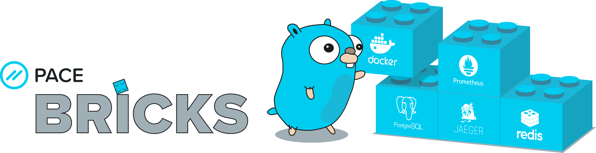

# PACE Bricks    

Opinionated microservice kit to help developers to build microservices with go.

## Opinions

A pace/bricks microservice is:

* build as a **docker container**
* deployed into a **kubernetes cluster**
* configured using **environment variables** ([TWELVE-FACTOR APP](https://12factor.net/))
* monitored using **prometheus**
* reports errors to **sentry**
* samples traces to **jaeger**
* **logs** to stdout using json
* offers **health** endpoints
* connects to backend services with logging, metrics and tracing:
  * **postgres** (logging, metrics, tracing)
  * **redis** (logging, metrics, tracing)
  * **http** (logging, metrics, tracing, retries)
* provides two commands **control** and **daemon**
* provides a **RESTful** API
  * code is generated from the **OpenAPIv3** spec
  * authenticated via **OAuth2**
  * encoded using **[json:api](https://jsonapi.org/)**
  * that supports **logging**, **tracing** and **metrics**

## Install

    go get github.com/pace/bricks/cmd/pb

## Usage

    pb -h

## Contributing
 
Read our [contributors guide](CONTRIBUTING.md).

## Requirements

* A working go installation
* A working git installation

## Testing

* Use `make test` to test without dependencies
* Use `docker-compose run bricks make integration` to test with dependencies

## Environment variables for the pb command

| Variable | Description |
|-|-|
| `PACE_BRICKS_EDITOR` |  The path to the editor that should be used for opening a project. Defaults to `$EDITOR`. |
| `PACE_BRICKS_PATH` | The path where new project should be created. Defaults to `$HOME/PACE`. |

## Bugs

If you experience this error: https://github.com/golang/go/issues/33563

Add this to your `go.mod`:

`replace github.com/streadway/handy => github.com/Teelevision/handy
v0.0.0-20190809134549-d074bcaebcac`

More details: https://github.com/golang/go/issues/33566
